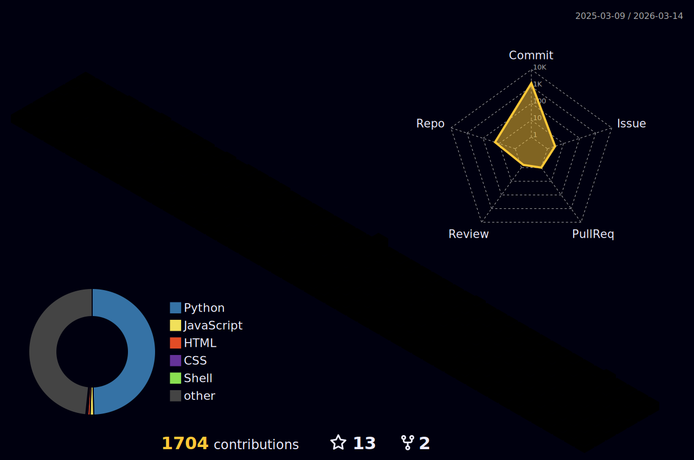

# Hi there 👋  
- 👨‍💻 Checkout:
  - [Silver Umbrella](https://ian729.github.io/silver-umbrella/), a personal blog for sharing my thoughts.
  - [NewsArchive](https://github.com/Ian729/NewsArchive), auto rss [New York Times](https://www.nytimes.com/rss) Global, US and Asia News
  - [HackerNewsArchive](https://github.com/Ian729/HackerNewsArchive), auto rss [HackerNews](https://news.ycombinator.com/)
  - [GitHub Spider](https://github.com/Ian729/githubSpider), auto follow popular GitHub users and auto star popular GitHub repos
  - [gitAnalysis](https://github.com/Ian729/gitAnalysis), a Python tool for analyzing Git commits and visualizing it in a contribution graph
  - [Chrome History Analysis](https://github.com/Ian729/chrome-history-analysis), a Python tool for analyzing Chrome Browsing History
  - [git-squash](https://github.com/ian729/git-squash), a git plugin that enables squashing commits based on branch_name/num_commits/commit_SHA
- 📖 Selected MSAI Courses are no longer available due to [complaint here](https://github.com/github/dmca/blob/master/2025/10/2025-10-28-original-work.md))
- 📖 Prepare for interviews:
  * [Leetcode(Chinese & English)](https://github.com/Ian729/leetcode)
  * [CompSci(Chinese & English)](https://github.com/Ian729/interview)
  * [Deep Learning(Chinese)](https://github.com/Ian729/DeepLearning-500-questions)
  * [CompSci Books](https://github.com/Ian729/CS-Books)
  * [DevOps(English)](https://github.com/Ian729/90DaysOfDevOps)
  * [System Design(English)](https://github.com/Ian729/system-design-resources)
  * [Free Programming Books](https://github.com/Ian729/free-programming-books)
- 📫 How to reach me: 438410248 @ WeChat

