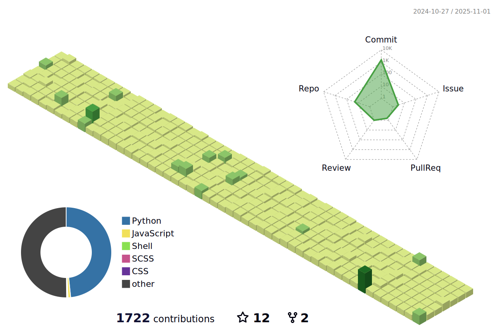

# Hi there 👋  
- 📖 Selected MSAI Courses:
  * [Artificial Intelligence](https://github.com/Ian729/AI6101-INTRODUCTION-TO-AI-AI-ETHICS)
  * [Mathematics](https://github.com/Ian729/AI6104-MATHEMATICS-FOR-ARTIFICIAL-INTELLIGENCE)
  * [Computer Vision](https://github.com/Ian729/AI6121-COMPUTER-VISION)
  * [Text Data and Management](https://github.com/Ian729/AI6122-Text-Data-Management-Analysis)
  * [Urban Computing](https://github.com/Ian729/AI6128-URBAN-COMPUTING)
  * [Machine Learning](https://github.com/Ian729/AI6102-MACHINE-LEARNING-METHODOLOGIES-AND-APPLICATIONS)
  * [Deep Learning](https://github.com/Ian729/AI6103-DEEP-LEARNING-APPLICATIONS)
  * [Multi-Agent System](https://github.com/Ian729/AI6125-MULTI-AGENT-SYSTEM)
  * [Advanced Computer Vision](https://github.com/Ian729/AI6126-ADVANCED-COMPUTER-VISION)
  * [Time Series Analysis](https://github.com/Ian729/AI6123-TIME-SERIES-ANALYSIS)
- 📖 Prepare for interviews:
  * [Leetcode(Chinese & English)](https://github.com/Ian729/leetcode)
  * [CompSci(Chinese & English)](https://github.com/Ian729/interview)
  * [Deep Learning(Chinese)](https://github.com/Ian729/DeepLearning-500-questions)
  * [CompSci Books](https://github.com/Ian729/CS-Books)
  * [DevOps(English)](https://github.com/Ian729/90DaysOfDevOps)
  * [System Design(English)](https://github.com/Ian729/system-design-resources)
- 👨‍💻 Checkout:
  - [doo.life](https://daysmatter.herokuapp.com), A web app for keeping your life on track.
  - [RSSHub](https://rsssub.herokuapp.com), A RSS aggregator.
  - [Silver Umbrella](https://ian729.github.io/silver-umbrella/), a personal blog for sharing my thoughts.
- 🇨🇦 Graduated with Distinction: B.Sc CompSci @ [University of Toronto](https://www.utoronto.ca/)
- 🇸🇬 Graduated: MSc in Artificial Intelligence @ [Nanyang Technological University](https://www.ntu.edu.sg/)
- 🔑 GPG key hosted here: [GitHub](https://github.com/ian729.gpg)
- 📫 How to reach me: 438410248 @ WeChat
- ☕️ Buy 💕Lulu a cup of coffee if this repo helps
- 

